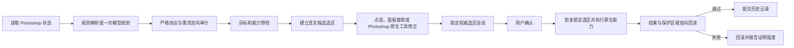

# v9.8 架构

## 主流程

## 信任边界

### 模型规划层

模型只能返回协议允许的 JSON 操作。v9.8 要求每个操作关联至少一个用户需求 `requirementId`，并同时检查：用户要求是否都被计划覆盖、计划中是否混入未获授权的操作、依赖关系是否有效。模型不能返回并执行 JavaScript。

视觉指令会先形成独立的 `visualContract`，把“实际修改目标”“空间上保持不变的区域”“需要保留的外观属性”分开记录。用户合同是授权来源；模型自由描述中自行增加的对象、保护项或外观词不能扩大权限。旧计划的 `description` 仍会被兼容转换，但执行前统一回到用户合同。

### UXP 面板

`uxp-v9.8` 负责读取状态、显示计划、建立和修正候选、保存权威选区、要求确认、调用能力并展示验收结果。协议与能力注册表目前一一对应 90 个动作。

### Photoshop 原生能力

`capabilities.js` 为每个动作提供参数边界、预检、执行和回读验收。选区提供者在分析阶段只负责建立候选；确认后执行若带有 `selectionSessionToken`，会恢复锁定选区，而不是重新计算自动候选。

### 本地桥接服务

`server.js` 只监听 `127.0.0.1`，统一模型厂商请求、运行 MobileSAM，并在本机用 OpenCV 校验批注截图与当前画面的视觉对应关系。业务请求必须带 `X-PS-Agent-Token`；浏览器 HTTP(S) Origin 被拒绝，UXP/插件来源才允许跨域。服务限制并发、缓存大小、请求体与响应体；客户端取消会传到排队任务或活动分割进程。

## 选区与人工纠正

所有选区提供者，包括矩形、椭圆、多边形、选择主体、区域主体、颜色范围、语义对象和载入图层，都进入统一确认门。

候选建立后由 `selection-session.js` 读取 Photoshop 当前选区像素，保存文档 ID、画布尺寸、局部蒙版、边界和摘要。面板自由套索可做替换、加选、减选、交集；用户也可在 Photoshop 中使用对象选择、快速选择、套索或选择并遮住，然后点击“采用 Photoshop 当前选区”。每次修正都会重新捕获并更新同一个会话。

置信度策略分为高、中、低和无候选。低置信度不能直接确认，除非用户已经修正或显式勾选接受；无候选时始终不能确认。

数值高置信度不能覆盖质量警告。完整对象覆盖不足、落点不可靠、分割预测分偏低或候选靠近保护区时，仍要求人工确认。多目标计划中某个目标无法建立候选时，可删除该目标及同一需求关联的操作；其他目标的权威选区会话继续保留。

## 语义分割

视觉模型只提供目标范围和候选点；对象、部位、方位、源颜色、空间保护与外观保留由结构化用户合同约束。只有明确的空间保护可以保留模型负点，高光、阴影、纹理、描边和形状等外观要求仍属于目标内部像素。MobileSAM 在本机生成二值蒙版，返回 `rle-cropped-v1`：原点、裁剪尺寸、画布尺寸和 RLE 计数均明确。UXP 只解码有界裁剪，不在大画布上分配完整蒙版。

MobileSAM 是粗候选工具，不等于语义理解，也不能取代发丝、透明、半透明等边缘的 Photoshop 选择并遮住流程。

## 状态、验收与回滚

分析和人工修正后会重新读取状态并更新执行指纹。每个步骤执行后先检查未授权图层或文档区域，再运行能力自己的结果验收。任一步失败时恢复历史状态，并再次比较文档、图层、选区和可用的合成摘要；如果无法证明精确恢复，会明确报错，不把“已尝试回滚”说成“已安全恢复”。
